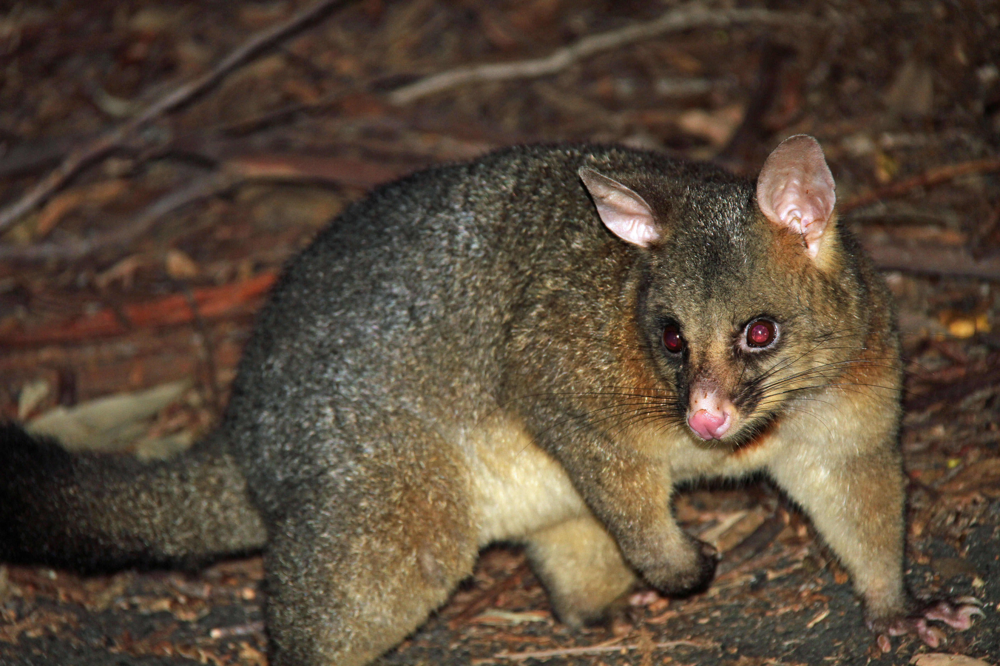

Brushtail possums are marsupials that live in Australia. Researchers captured 104 of these animals and took body measurements before releasing the animals back into the wild. 

The common brushtail possum of the Australia region is a bit cuter than its distant cousin, the American opossum. The 104 brushtail possums in the sample are from two regions in Australia, where the possums may be considered a random sample from the population. The first region is Victoria, which is in the eastern half of Australia and traverses the southern coast. The second region consists of New South Wales and Queensland, which make up eastern and northeastern Australia. (Reference:  *Introduction to Modern Statistics*)

```{r echo = FALSE, out.height="30%", out.width = "50%"}

```

The possum data is in the Openintro library.  Below are all of the libraries we will need for this lab:
```{r libraries, message = FALSE, warning = FALSE}
library(tidyverse)
library(openintro)
library(tidymodels)
library(caret)
```

Our goal in this lab is to use logistic regression to classify possums as being from the region Victoria or elsewhere. We will consider five predictors: `sex` (an indicator for a possum being male), `head_l` (head length), `skull_w` (skull width), `total_l` (total length), and `tail_l` (tail length).


## Exercises

1.  Use `?possum` in your Console to view the data dictionary for the possum dataset.  Create a new variable called `type` that takes value 1 when a possum is from Victoria and 0 when it is from New South Wales or Queensland.  This new variable `type` will be the response variable for our logistic regression model.  Be sure to assign it type `factor` using a `mutate` statement as follows: `type = as.factor(type)`.

2. Split the possum data into training data and testing data using an 80/20 split using the code below:

```{r Q2}
set.seed(4321)
possum_split <- initial_split(possum, prop = 0.80)

train_data <- training(possum_split)
test_data <- testing(possum_split)
```


3.  Create appropriate visualizations to explore the relationship between `type` and each of the variables we plan to use as predictor variables in our model:  `sex` (an indicator for a possum being male), `head_l` (head length), `skull_w` (skull width), `total_l` (total length), and `tail_l` (tail length).  Comment on what you discover from your visualizations.  Be sure to use the training data!

4.  Fit a logistic regression model to predict `type` from `sex` (an indicator for a possum being male), `head_l` (head length), `skull_w` (skull width), `total_l` (total length), and `tail_l` (tail length). Call you model output `possumb_fit`. Use `glance` to find the AIC value for this model.

5.  Eliminate the predictor variable with the highest (non-significant) p-value and fit the logistic regression model again.  Call your new model output `possum_fit2`.  Did you notice an improvement in the AIC (recall that smaller AIC values are better)?  

6.  Write down your model for predicting which region a possum is from.  Which predictor variables have a positive association with a possum being from Victoria?

7.  Suppose we see a brushtail possum at a zoo in the US, and a sign says the possum had been captured in the wild in Australia, but it doesn’t say which part of Australia. However, the sign does indicate that the possum is male, its skull is about 63 mm wide, its tail is 37 cm long, and its total length is 83 cm. What is your model’s computed probability that this possum is from Victoria?

8.  Finally, we will see how well our model classifies whether a possum is from Victoria or not using "new" observations (our test data).  We will use 0.5 as our probability cut-off, meaning if the predicted probability is greater than 0.5, then the possum is classified as Victoria.  

Run the code below to generate the confusion matrix and the ROC curve for your model `possum_fit2`.  What is the accuracy rate for your model?  What is the area under your ROC curve?

```{r eval = FALSE}

# Calculate predicted probability values
possum_pred <- predict(possum_fit2, test_data, type = "response")
#Set probability cut-off at 0.5
pred_num <- ifelse(possum_pred > 0.5, 1, 0)  

# make classification values a factor with values 0 and 1
pred_num <-factor(pred_num, levels = c(0, 1))

#Generate confusion matrix
confusionMatrix(pred_num, test_data$type, positive = "1")
```

```{r eval = FALSE}

# create a tibble with predicted values and observed values (type) from the test data
# when we put the vector of predicted probabilities into a tibble, the column name becomes "value".
# We will first rename the column "value" to be "pred"
possum_pred <- as_tibble(possum_pred) %>%
  rename(pred = value)

# Use bind columns to join the predicted values to the test data response values
possum_pred <- possum_pred %>%
  bind_cols(test_data %>% select(type, pop))

# plot ROC curve
possum_pred %>%
  roc_curve(truth = type, pred, event_level = "second") %>%
  autoplot()

# Calculate area under the ROC curve
possum_pred %>%
  roc_auc(truth = type, pred, event_level = "second")
```